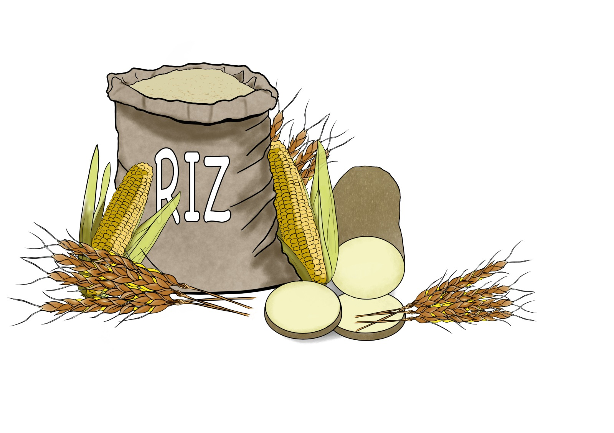

# Basmatinet

Welcome to this project folks !

Whether you like it or not this project is all about riiiiice or riz in french. It is also about Deep Learning and MLOPS. So if you want to learn to train and deploy a simple model to recognize rice type basing on a photo, then you are at the right place. 

<p align="center">
  
</p>


## 0- Project's Roadmap

This project will consist to:

- [x] Train a Deep Learning model with Pytorch.
- [x] Transfert learning from Efficient Net.
- [x] Data augmentation with Albumentation.
- [x] Save trained model with early stopping.
- [x] Track the training with MLFLOW.
- [x] Serve the model with a Rest Api built with Flask.
- [x] Encrypt data client side before sending to the api server to allow confidentiality.
- [x] Package the application in microservice's fashion with Docker.
- [x] Yaml for configurations file.
- [x] Passing arguments anywhere it is possible.
- [x] Orchestration the prediction service with Kubernetes (k8s) on Google Cloud Platform.
- [ ] Logging during training.
- [ ] CI/CD.
- [ ] Save images and predictions in InfluxDB database.
- [ ] Unitary tests with Pytest (Fixtures and Mocks).
- [ ] Data Drift monitoring. 
- [ ] Concept Drift monitoring. 
- [ ] Monitoring avec Grafana.

## 1- Install project's dependencies and packages
This project was developped in conda environment but you can use any python virtual environment but you should have installed some packages that are in basmatinet/requirements.txt
```bash
# Move into the project root
cd basmatinet
# 1st alternative: using pip
pip install -r requirements.txt
# 2nd alternative
conda install --file requirements.txt
```

## 2- Train a basmatinet model
```bash

```
## 3- Dockerize the model and push the Docker Image to Google Container Registry

1st step: Let's build a docker images
```bash
# Move into the app directory
cd basmatinet/app
# Build the machine learning serving app image
docker build -t basmatinet .
# Run a model serving app container outside of kubernetes (optionnal) 
docker run -d -p 5000:5000 basmatinet
# Try an inference to test the endpoint
python frontend.py
```

2nd step: Let's push the docker image into a Google Container Registry. But you should create a google cloud project to have PROJECT-ID and in this case you HOSTNAME will be "gcr.io" and you should enable GCR Api on google cloud platform.

```bash
# Re-tag the image and include the container in the image tag
docker tag basmatinet [HOSTNAME]/[PROJECT-ID]/basmatinet
# Push to container registry
docker push [HOSTNAME]/[PROJECT-ID]/basmatinet
```

## 4- Create a kubernetes cluster
First of all you should enable GKE Api on google cloud platform. And go to the cloud shell or stay on your host if you have gcloud binary already installed.

```bash
# Start a cluster
$ gcloud container clusters create k8s-gke-cluster --num-nodes 3 --machine-type g1-small --zone us-west1-b
# Connect to the cluster
$ gcloud container clusters get-credentials k8s-gke-cluster --zone us-west1-b --project [PROJECT_ID]

```

## 4- Deploy the application on Kubernetes (Google Kubernetes Engine)
Create the deployement and the service on a kubernetes cluster.
```bash
# In the app directory 
kubectl apply -f k8s

# Check that everything is alright with the following command and look for basmatinet-app in the output
kubectl get services
# The output should look like
NAME             TYPE           CLUSTER-IP    EXTERNAL-IP     PORT(S)          AGE
basmatinet-app   LoadBalancer   xx.xx.xx.xx   xx.xx.xx.xx   5000:xxxx/TCP      2m3s
```
Take the EXTERNAL-IP and test your service. Then you can cook your jollof with some basmatinet!!! 
